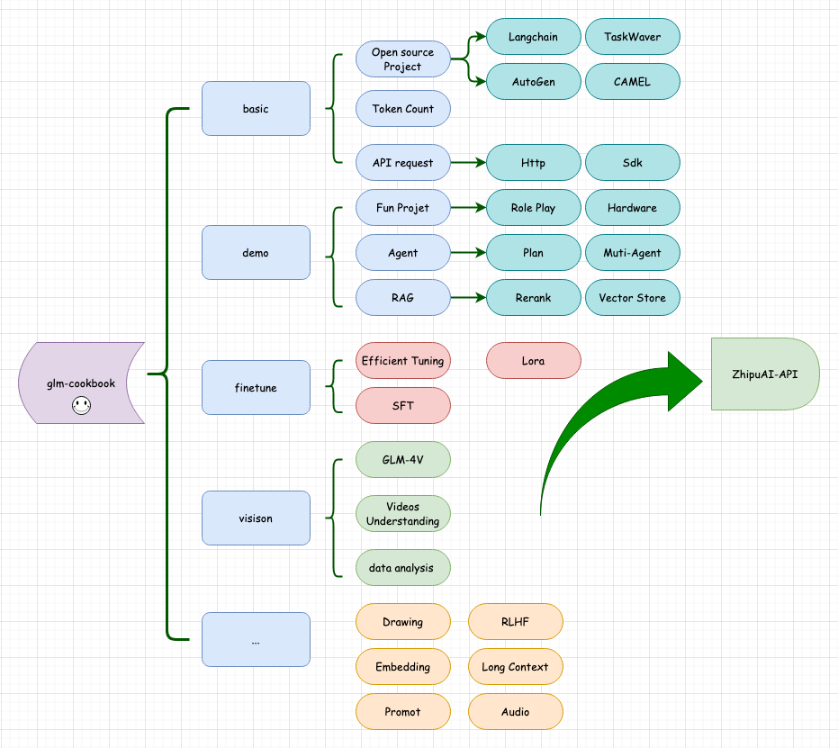

<h1>
  
  glm-cookbook
</h1>

[Read this in English](README_en.md)

欢迎来到 GLM API 模型入门仓库📘。这是一本开源的 GLM API 入门代码教材。

在这里，你会发现丰富的 **代码示例👨‍**、**实用指南🗺**️ 以及 **资源链接🔗**，或许能帮助你轻松掌握 GLM API 的使用！

## 更新情况 🔥
+ 🔥 2024-03-06: 仓库所在组织 [MetaGLM](https://github.com/MetaGLM) 更新了4门语言 (Python, Java,C#,Node.js) 的SDK，欢迎提出意见和对项目进行PR！
+ 🔥 2024-03-01: 仓库更新了 [glms](glms/glms.md), 一些有趣的 GLMs (智谱清言) 欢迎体验！GLM-4 API
  最大输出长度可以调整到`8192`了，支持联网工具调用，相见[这里](basic/glm_function_call.ipynb)
+ 🔥 2024-02-07: 仓库更新了 [InterpretationoDreams](demo/interpretationo_dreams)，体验项目，使用 GLM-4 来完成梦中解析和角色扮演！
+ 🔥 2024-02-04: 仓库更新了 [有趣的 GLMs列表](asset/glms.md)，欢迎体验！基础教程已基本覆盖 GLM-4 API 文档的内容，欢迎体验！

## 快速开始 🚀

1. 要开始使用GLM API，你首先需要一个 GLM API 账户和相应的 API 密钥。
   如果你还没有账户，可以在 [这里](https://open.bigmodel.cn/) 免费注册。

2. 我的代码以 **Python, Jupyter Note** 为主，但同样的概念也可以应用于其他编程语言（不过这可能要你们自己实现咯）。
   这些代码示例旨在帮助我（或许也能对你）如何高效地使用 GLM API 完成常见的简单任务。 推荐使用`Python 3.9 - 3.12`
   的版本（我自己是Python 3.10）。你需要安装必须的依赖，才能更好的使用 Demo。你可以使用以下命令来安装总的依赖：

```bash
pip install -r requirements.txt
```

3. 对了，我一般使用 ✅GLM4 来完成任务，我也推荐你使用这个模型哦！

## 仓库文件 📂

我已经分类好了多个文件夹，这些文件夹都有自己的内容，你可以根据自己的需求来查看！

+ 🌱`basic` 最基础的内容，帮助你熟悉基本的 API 调用。

+ 👁️`vision` 关于视觉模型和绘图模型的调用和基本应用。

+ 🔧`finetune` 或许可以来这里找找微调的内容？

+ 🎉`demo` 一些有趣的小项目，或许可以激发点灵感。
    + 🤖`agent` 看看发布会的智能体有多厉害！
    + 📚`data` 运行demo所需要的数据。

+ 📊`glms` GLMs (智谱清言) 专区，即使你不会代码，也能快速上手！

+ 🏠`asset` 一些相关的图片资料


你可以通过以下图片快速了解本仓库构成, 我将尽快同步更新 Zhipu AI SDK的最新实验和教学内容。



## 开源SDK

GLM-4系列SDK已经开源，如果你想直接在我们的SDK上进行修改，可以按照以下地址进行需改：

+ [Python SDK](https://github.com/MetaGLM/zhipuai-sdk-python-v4)
+ [Java SDK](https://github.com/MetaGLM/zhipuai-sdk-java-v4)
+ [C# SDK](https://github.com/MetaGLM/zhipuai-sdk-csharp-v4)
+ [Node.js SDK](https://github.com/MetaGLM/zhipuai-sdk-nodejs-v4)
+ 如果你有其他语言的SDK想贡献到官方仓库，欢迎提出PR。

## 贡献指南 🤝

欢迎大家贡献自己的想法和代码！如果你有任何建议或想添加自己的代码，请随时提交 Pull Request 或开 Issue 讨论。
如果你喜欢这个仓库，欢迎给它一个 ⭐，这将对我有很大帮助！