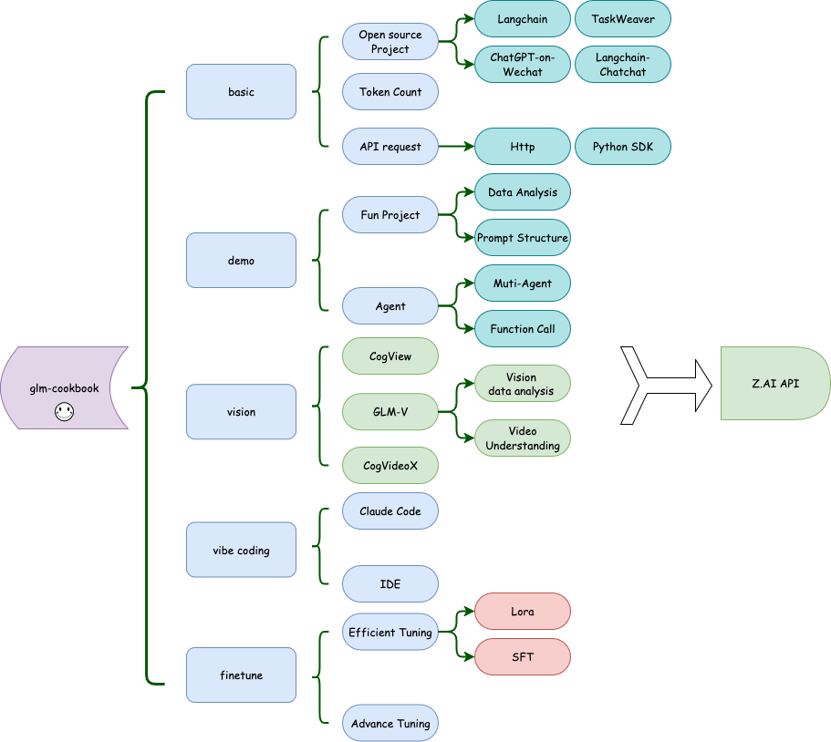

<h1>
  
  GLM-CookBook
</h1>

[Read this in English](README.md)

欢迎来到 GLM API 入门仓库📘。这是一本开源的 GLM API 入门代码教材。

## 更新情况 🔥

+ 🔥 GLM-4.5 接入 Claude Code，详见 [GLM-4.5 Claude Code 集成指南](vibecoding/glm-4.5-claude-code-integration.md)。

## 快速开始 🚀

1. 安装相关依赖

```bash
pip install -r requirements.txt
```

2. 配置 [Z.AI](https://z.ai/model-api) 的账户，或者 [openrouter](https://openrouter.ai/settings/keys) 账户。

## 仓库文件 📂

我们已经分类好了多个文件夹，这些文件夹都有自己的内容，你可以根据自己的需求来查看！

+ `basic` 最基础的内容，帮助你熟悉基本的 API 调用。

+ `vision` 关于视觉模型和绘图模型的 API 调用。

+ `vibecoding` 关于使用 GLM 系列模型进行代码开发的例子。

+ `finetune` 微调 GLM 模型。

+ `demo` 一些有趣的小项目，或许可以激发点灵感。
  + `agent` 看看发布会的智能体有多厉害！
  + `data` 运行demo所需要的数据。

+ `asset` 一些相关的图片资料

你可以通过以下图片快速了解本仓库构成, 我将尽快同步更新 Zhipu AI SDK的最新实验和教学内容。



## SDK开源 🔧

Z.AI SDK已经开源，如果你想直接在我们的SDK上进行修改，可以按照以下地址进行需改：

+ [Python SDK](https://github.com/MetaGLM/zhipuai-sdk-python-v4)
+ [Java SDK](https://github.com/MetaGLM/zhipuai-sdk-java-v4)
+ [C# SDK](https://github.com/MetaGLM/zhipuai-sdk-csharp-v4)
+ [Node.js SDK](https://github.com/MetaGLM/zhipuai-sdk-nodejs-v4)

如果你有其他语言的SDK想贡献到官方仓库，欢迎提出PR。
