# ChatGLM: A Family of Large Language Models from GLM-130B to GLM-4 All Tools

**Team GLM**  
1Zhipu AI 2Tsinghua University

---

## Abstract

We introduce ChatGLM, an evolving family of large language models that we have been developing over time. This report
primarily focuses on the GLM-4 language series, which includes GLM-4, GLM-4-Air, and GLM-4-9B. They represent our most
capable models that are trained with all the insights and lessons gained from the preceding three generations of
ChatGLM. To date, the GLM-4 models are pre-trained on ten trillions of tokens mostly in Chinese and English, along with
a small set of corpus from 24 languages, and aligned primarily for Chinese and English usage. The high-quality alignment
is achieved via a multi-stage post-training process, which involves supervised fine-tuning and learning from human
feedback. Evaluations show that GLM-4 1) closely rivals or outperforms GPT-4 in terms of general metrics such as MMLU,
GSM8K, MATH, BBH, GPOA, and HumanEval, 2) gets close to GPT-4-Turbo in instruction following as measured by IFEval, 3)
matches GPT-4 Turbo (128K) and Claude 3 for long context tasks, and 4) outperforms GPT-4 in Chinese alignments as
measured by AlignBench. The GLM-4 All Tools model is further aligned to understand user intent and autonomously decide
when and which tool(s) to use—including web browser, Python interpreter, text-to-image model, and user-defined
functions—to effectively complete complex tasks. In practical applications, it matches and even surpasses GPT-4-Turbo in
tasks like accessing online information via web browsing and solving math problems using Python interpreter. Over the
course, we have open-sourced a series of models, including ChatGLM-6B (three generations), GLM-4-9B (128K, 1M),
GLM-4V-9B, WebGLM, and CodeGeeX, attracting over 10 million downloads on Hugging face in the year 2023 alone. The open
models can be accessed through [https://github.com/THUDM](https://github.com/THUDM)
and [https://huggingface.co/THUDM](https://huggingface.co/THUDM).

---

*Team GLM: Aohan Zeng, Bin Xu, Bowen Wang, Chenhui Zhang, Da Yin, Diego ROJAS, Guanyu Feng, Hanlin Zhao, Hanyu Lai, Hao
Yu, Hongning Wang, Jiachi Jiang, Jiajie Zhang, Jiale Cheng, Jiayi Gui, Jie Tang, Jing Zhang, Junzi Li, Lei Zhao, Lindong
Wu, Lucen Zhong, Mingdao Liu, Minlie Huang, Peng Zhang, Qinkai Zheng, Rui Liu, Shuaiji Duan, Shudan Cao, Shunxun Yang,
Weng Kam Tam, Weny Zhao, Xiao Liu, Xiao'an Zhang, Xiaotao Gao, Xin Lv, Xinghan Liu, Xinyi Liu, Xiumye Yang, Xixuan Song,
Xunhai Zhang, Yifan An, Yifan Xu, Yilin Niu, Yuantao Yang, Yueyan Li, Yushi Bai, Yuxiao Dong, Zehan Qi, Zhaoyu Wang,
Zhen Yang, Zhengxiao Du, Zhenyu Hou, Zihan Wang.*  
*Team members are listed alphabetically by first name.*

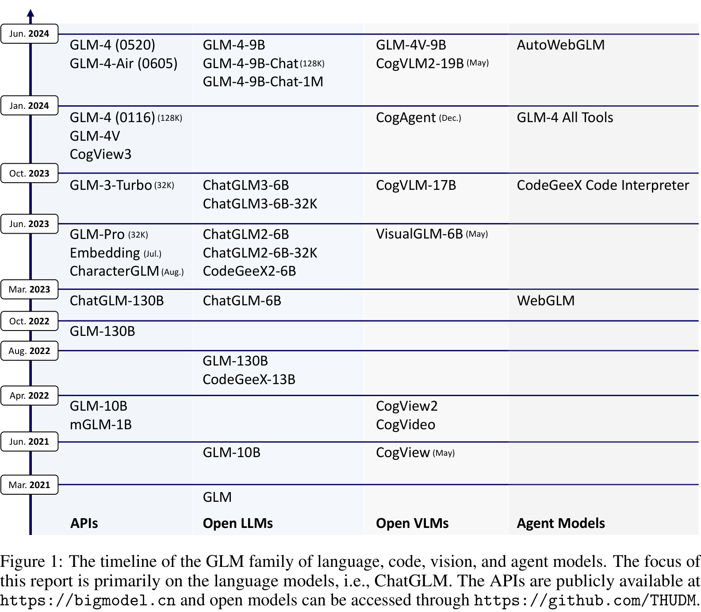

Figure 1: The timeline of the GLM family of language, code, vision, and agent models. The focus of this report is
primarily on the language models, i.e., ChatGLM. The APIs are publicly available
at [https://bimgodel.cn](https://bimgodel.cn) and open models can be accessed
through [https://github.com/THUDM](https://github.com/THUDM).

# 1 Introduction

ChatGPT has been phenomenal, whose capabilities was initially powered by the GPT-3.5 model [25] in November 2022 and
subsequently upgraded to GPT-4 [27] in March 2023. According to OpenAI, the GPT-3.5 series improved upon GPT-3 by
incorporating instruction tuning, supervised fine tuning (SFT), and/or reinforcement learning from human feedback (
RLHF) [28]. The original GPT-3 released in 2020 [3] marked a significant scale-up from GPT-1’s 117 million parameters
and GPT-2’s 1.5 billion parameters, to 175 billion parameters. This scale-up enables GPT-3 with in-context learning and
generalized capabilities, spurring the emergence of large language models (LLMs) [6; 41].

Inspired by GPT-3, we proposed the General Language Model (GLM) architecture [11] featured with the autoregressive blank
infilling objective and open-sourced the GLM-100B model in 2021 (See the GLM timeline in Figure 1). Starting in late
2021, we began pre-training GLM-130B [54]. The goal was to train a 100B-scale model to match or surpass GPT-3 (davinci)
while also verifying the techniques for successfully training models at this scale, along with other efforts such as
OPT-175B [55] and BLOOM-176B [32]. We completed the 400B-token training and evaluation of GLM-130B in July, and
subsequently released the model and pre-training details [54] in August 2022. According to HELM in November 2022,
GLM-130B matches GPT-3 (davinci) across various dimensions [19].

Following this, we initiated instruction tuning on GLM-130B. Later, ChatGPT further motivated us to align the base
models with SFT and RLHF. We created and crafted the prompt-response pairs from scratch and preformed SFT, while also
starting to examine how to effectively apply RLHF. On March 14, 2023, the aligned model, ChatGLM-130B, went live
on [https://chatglm.cn](https://chatglm.cn). In addition, a smaller version, ChatGLM-6B [13], was open-sourced at the
same day, attracting significantly more attention than anticipated. It was designed to have 6.2 billion parameters for (

1) facilitating

# Search for the global population from 2000 to 2023, then calculate the average annual growth rate.

According to the information I found, from 2000 to 2023, the global population grew from about 6.15 billion to about
8.05 billion.

Starting and ending population values:

- Starting population = 6.15B in 2000
- Ending population = 8.05B in 2023
- Number of years = 2023 - 2000 = 23 years

Formula:
$$ \text{Average annual growth rate} = \left( \frac{\text{ending population}}{\text{starting population}} \right)
^{\frac{1}{\text{years}}} - 1 $$

Result: 1.1775991484071

The average annual growth rate of the global population from 2000 to 2023 was approximately 1.18%.

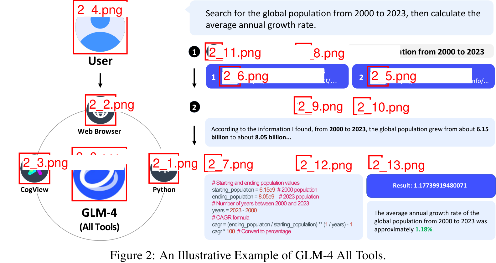

# Performance of Open ChatGLM-6B, ChatGLM2-6B, ChatGLM3-6B, and GLM-4-9B

| Language | Dataset       | ChatGLM-6B (2023-03-14) | ChatGLM2-6B (2023-06-25) | ChatGLM3-6B-Base (2023-10-27) | GLM-4-9B (2024-06-05) |
|----------|---------------|-------------------------|--------------------------|-------------------------------|-----------------------|
| English  | GSM8K         | 1.5                     | 25.9                     | 72.3                          | 84.0                  |
|          | MATH          | 3.1                     | 6.9                      | 25.7                          | 30.4                  |
|          | BBH           | 0.0                     | 29.2                     | 66.1                          | 76.3                  |
|          | MMLU          | 25.2                    | 45.2                     | 61.4                          | 74.7                  |
|          | GPQA          | -                       | -                        | 26.8                          | 34.3                  |
|          | HumanEval     | 0.0                     | 9.8                      | 58.5                          | 70.1                  |
|          | BoolQ         | 51.8                    | 79.0                     | 87.9                          | 89.6                  |
|          | CommonSenseQA | 20.5                    | 65.4                     | 86.5                          | 90.7                  |
|          | HellaSwag     | 30.4                    | 57.0                     | 79.7                          | 82.6                  |
|          | PIQA          | 65.7                    | 69.6                     | 80.1                          | 79.1                  |
|          | DROP          | 3.9                     | 25.6                     | 70.9                          | 77.2                  |
| Chinese  | C-Eval        | 23.7                    | 51.7                     | 69.0                          | 77.1                  |
|          | CMMLU         | 25.3                    | 50.0                     | 67.5                          | 75.1                  |
|          | GAOKAO-Bench  | 26.8                    | 46.4                     | 67.3                          | 74.5                  |
|          | C3            | 35.1                    | 58.6                     | 73.9                          | 77.2                  |

# 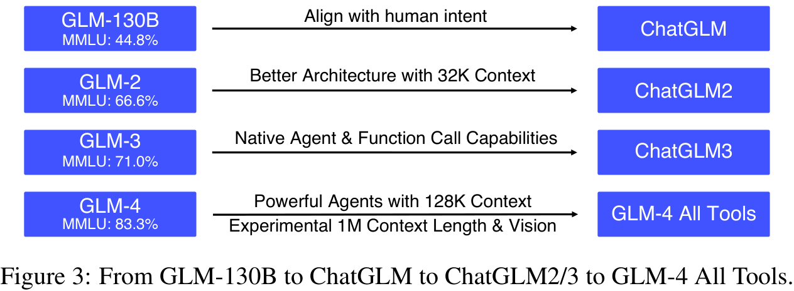

## 2 ChatGLM Techniques

In this section, we cover both the pre-training and post-training techniques we adopted and developed in ChatGLM,
including model architecture, pre-training data, alignment, and All Tools. We have detailed technical reports
introducing each of the major techniques we used to reach GLM-4.

### Pre-Training Data

Our pre-training corpus consists of multilingual (mostly English and Chinese) documents from a mixture of different
sources, including webpages, Wikipedia, books, code, and papers. The data processing pipeline mainly includes three
stages: deduplication, filtering, and tokenization. The deduplication stage improves data diversity by removing
duplicated or similar documents, with both exact deduplication and fuzzy deduplication. The filtering stage improves
data quality by removing noisy documents that contain offensive language, placeholder text, source code, etc. The
tokenization stage converts the text into a sequence of tokens for further processing. The number of tokens in the
pre-training data directly affects model training speed. To optimize this aspect, we employ the byte-level byte pair
encoding (BPE) algorithm [33] to separately learn the Chinese and multilingual tokens merge them with the tokens of the
cl100k_base tokenizer in tiktoken [26] into a unified vocabulary with a size of 150,000. In the final training set, we
re-weight different sources to increase the ratios of high-quality and educational sources like books and Wikipedia. To
this end, the pre-training corpus consists of around ten trillion tokens.

Throughout the four generations of ChatGLM development, our findings align with existing studies [60]: data quality and
diversity are crucial for building effective LLMs. Despite the empirical lessons and insights gained, we have to date
yet to identify a fundamental principle that could guide the processes of data collection, cleaning, and selection.

### Architecture

The GLM family of LLMs is built on Transformer [43]. In GLM-130B [54], we explored various options to stabilize
pre-training by taking into account the hardware constraints we faced at the time. Specifically, GLM-130B leveraged
DeepNorm [44] as the layer normalization strategy and used Rotary Positional Encoding (RoPE) [38] as well as the Gated
Linear Unit [35] with GeLU [15] activation function in FFNs. Throughout our exploration, we have investigated different
strategies to enhance model performance and inference efficiency. The recent GLM-4 model adopts the following
architecture design choices.

- **No Bias Except QKV**: To increase training speed, we have removed all bias terms with the exception of the biases in
  Query, Key, and Value (QKV) of the attention layers. In doing so, we observed a slight improvement in length
  extrapolation.
- **RMSNorm and SwiGLU**: We have adopted RMSNorm and SwiGLU to replace LayerNorm and ReLU, respectively. These two
  strategies have been observed with better model performance.
- **Rotary positional embeddings (RoPE)**: We have extended the RoPE to a two-dimensional form to accommodate the 2D
  positional encoding in GLM.
- **Group Query Attention (GQA)**: We have replaced Multi-Head Attention (MHA) with Group Query Attention (GQA) to cut
  down on the KV cache size during inference. Given GQA uses fewer parameters than MHA, we increased the FFN parameter
  count to maintain the same model size, i.e., setting $d_{ffn}$ to 10/3 of the hidden size.

The context length of our models was extended from 2K (ChatGLM), to 32K (ChatGLM2 and ChatGLM3), and to 128K and 1M (
GLM-4). This expansion was achieved not only through context

---

extension—position encoding extension [30, 5] and continual training [47] on long text—but also long context alignment,
enabling GLM-4 to effectively handle long contexts (Cf [1] for technical details).

### Alignment

Pre-training builds the foundation of LLMs while post-training [28] further refines these models to align with human
preferences, such as understanding human intents, following instructions, and facilitating multi-turn dialogues. For
GLM-4, the alignment is mostly achieved with supervised fine-tuning (SFT) and reinforcement learning from human
feedback (RLHF) [17]. In SFT, we find that authentic human prompts and interactions instead of template-based or
model-generated responses are vital to the alignment quality. While SFT largely aligns the base models with human
preferences, RLHF can further help mitigate issues of response rejection, safety, mixture of bilingual tokens generated,
and multi-turn coherence among others.

For the first generation of models (ChatGLM-6B and ChatGLM-130B), the prompt-response pairs were mostly annotated by the
model developers. For later models, the alignment data is a combination of in-house annotating data and proprietary data
acquired from third parties, subject to relatively strict quality control measures. Similar to existing practice [42],
annotators are instructed to score model responses from several dimensions, including safety, factuality, relevance,
helpfulness, and human preferences.

### ChatGLM Techniques

Throughout the development of ChatGLM, we have introduced and will publish techniques that are used to enhance its
performance.

* **Emergent Abilities of LLMs [12]**: We examined the relationship between pre-training loss and performance on
  downstream tasks and found that with the same pre-training loss, LLMs of different model sizes and training tokens
  generate the same downstream performance. We also find that on some tasks (such as MMLU and GSM8K), the performance
  improves beyond random chance only when the pre-training loss falls below a certain threshold. We thus redefine
  emergent abilities as those exhibited by models with lower pre-training loss [12].

* **Long-Chain [19]**: To extend LLMs' context size, we proposed LongChain—a comprehensive recipe for long context
  alignment. It enables GLM-4 to process long context texts (up to 128K tokens) with performance comparable to that of
  Claude 2 and GPT-4 Turbo (1106).

* **ChatGLM-Math [48]**: For the improvement of math problem solving in LLMs, we introduced ChatGLM-Math that leverages
  self-curricula rather than external models or manual annotations for data selection.

* **ChatGLM-RLHF [17]**: To align LLMs with human feedback, we introduced ChatGLM-RLHF—our practices of applying PPO and
  DPO into LLMs.

* **Self-Contrast [22]**: To avoid the need for expensive human preference feedback data, we developed a feedback-free
  alignment strategy Self-Contrast. It utilizes the target LLM itself to self-generate massive negative samples for its
  RLHF alignment.

* **AgentTuning [53]**: To improve LLMs' agent capabilities, we developed the AgentTuning framework with the
  AgentInstruct instruction-tuning dataset that includes high-quality interaction trajectories between agents and
  environment.

* **APAR [20]**: To improve the inference speed of LLMs for responses with hierarchical structures, we presented an
  auto-parallel auto-regressive (APAR) generation approach. It leverages instruct tuning to train LLMs to plan their (
  parallel) generation process and execute APAR generation.

* **Benchmarks**: We also developed several open LLM benchmarks, including AgentBench [23] for evaluating LLMs as
  agents, LongBench [2] for evaluating the long context handling performance of LLMs, AlignBench [1] to measure the
  alignment quality of ChatGLM with Chinese language content, HumanEval-X [58] to evaluate HumanEval [4] problems in
  programming languages beyond Python, as well as NaturalCodeBench (NCB) to measure models’ capacities to solve
  practical programming tasks.

### GLM-4 All Tools

The latest ChatGLM models are GLM-4 and GLM-4 All Tools, both of which were trained and aligned by using the techniques
above. GLM-4 All Tools is a model version further aligned to support intelligent agents and related tasks. It can
autonomously understand user intent, plan complex instructions, and call one or multiple tools (e.g., Web browser,
Python interpreter, and the text-to-image model) to complete complex tasks. Figure 4 presents the overall pipeline of
the GLM-4 All Tools system. When a user issues a complex request, the model analyzes the task and

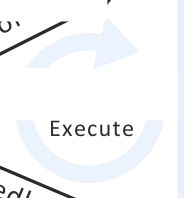

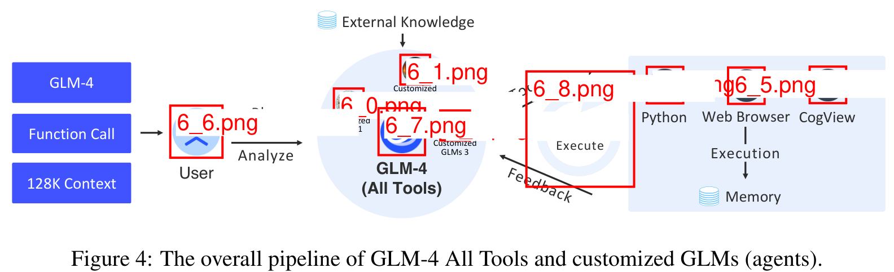

Figure 4: The overall pipeline of GLM-4 All Tools and customized GLMs (agents).

* BBH [39]: A suite of 23 challenging BIG-Bench [37] tasks. We use chain-of-thought prompting [46] for this benchmark.
* GPOA [31]: A graduate-level multi-choice benchmark in biology, chemistry, and physics.
* HumanEval [4]: A coding benchmark that measures correctness of synthetic functions with automatic test-case checking.

We compare the performance of GLM-4 with the original GPT-4 [27]. The results are shown in Table 2. We can observe that
GLM-4 achieves 96.3% of GPT-4’s accuracy on MMLU, and outperforms GPT-4 on other benchmarks. Overall, the base capacity
of GLM-4 approaches that of GPT-4-Turbo and Claude 3 Opus.

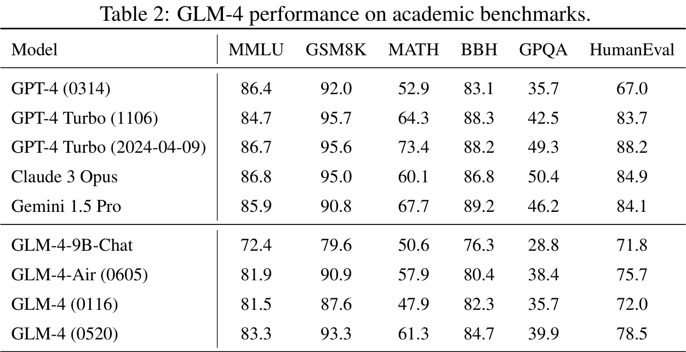

### 3.2 Evaluation of Instruction Following

We assess the proficiency of GLM-4 in following instructions with the recently-introduced IFEval dataset [61]. The
dataset comprises 541 prompts derived from 25 distinct instructions that are verifiable through explicit criteria (e.g.,
“end your email with: P.S. I do like cake” can be verified via string matching). We adhere to the methodologies outlined
by [61] to calculate prompt-level and instruction-level accuracy in both strict mode and loose mode. To further evaluate
the model’s performance on following instructions in Chinese, we translate the original prompts into Chinese, omitted
instructions that are not applicable in Chinese (such as capitalization), and adjust the scoring scripts to accommodate
Chinese data.

The English and Chinese sections in Table 3 show results in both English and Chinese, respectively. In loose mode, GLM-4
matches instruction-level accuracy achieved by GPT-4 Turbo in both English and Chinese. In strict mode, GLM-4 achieves
99.0% and 98.6% of instruction-level accuracy of GPT-4 Turbo (2024-04-09) in English and Chinese, respectively.

### 3.3 Evaluation of Alignment

AlignBench [21] provides an automatic LLMs-as-Judge method to benchmark the alignment of LLMs in Chinese context. It
consists 683 queries spanning 8 different categories, and judges model responses using a GPT-4 based multidimensional
rule-calibrated pointwise reference-based scoring method. We evaluate on AlignBench-v1.1, which more carefully improves
the reference generation quality, especially by complementing human-collected evidences from webpages with urls for
knowledge-requiring problems that takes up 66.5% of total queries. On this version, almost all LLMs achieve lower scores
than they do in the previous AlignBench more or less.

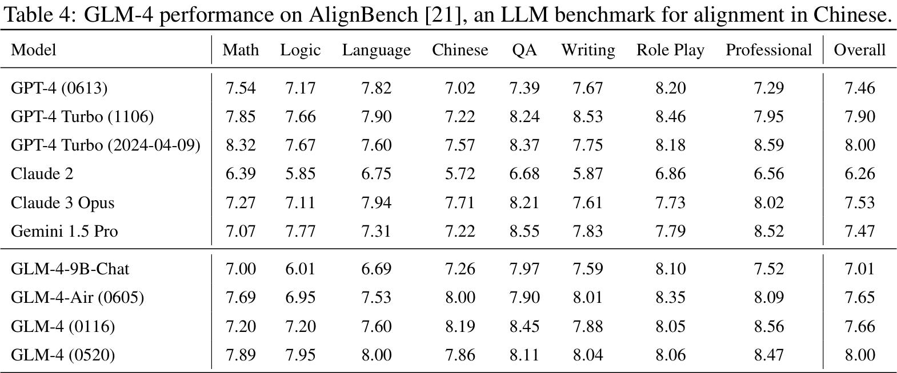

Results are shown in Table 4. GLM-4 outperforms GPT-4 Turbo, Claude 3 Opus, and Gemini 1.5 Pro in general, achieves the
highest overall score among the baselines. Especially on Chinese Logic Reasoning and Language Understanding dimensions,
GLM-4 significantly outperforms all other powerful models. These results demonstrate its strong grasping of Chinese
language and knowledge.

The current performance gap between GLM-4 and GPT-4 Turbo (2024-04-09) mostly lies in the Mathematics dimension. We have
been employing techniques introduced in ChatGLM-Math [48] such as self-critique to continuously enhance GLM models’
reasoning capabilities.

### 3.4 Evaluation of Long Context Handling Abilities

To obtain the performance of GLM-4 on long text tasks, we carry out evaluations on LongBench-Chat [1], a benchmark set
with contextual lengths ranging from 10-100k, encompassing a wide range of long text scenarios frequently utilized by
users, such as document Q&A, summarizing, and coding. In our quest to provide a more detailed comparison of the
performance of GLM-4 in different languages, we also segregate LongBench-Chat according to language. This yields two
distinct portions: Chinese and English. We have accordingly supplied the results for both segments separately, offering
a fine-grained overview of how GLM-4’s cross-linguistic capabilities.

Regarding the specific evaluation settings, we score the outputs of each model based on GPT-4, adopting a few-shot
strategy within LongBench-Chat. Moreover, given our objective to minimize score variations and to reach a more reliable
statistical conclusion, we conduct repeated evaluations. Subsequently, we compute the average from these multiple
evaluations to ensure that the final performance metric reflects a thorough understanding of how GLM-4 behaves under
diverse conditions.

Table 5 features the results obtained from our experiments. It can be clearly observed that the performance of GLM-4
aligns with that of GPT-4 Turbo and Claude 3 Opus on English prompts, and it can outperform the best of them on Chinese
prompts.

## Performance on LongBench-Chat [2]

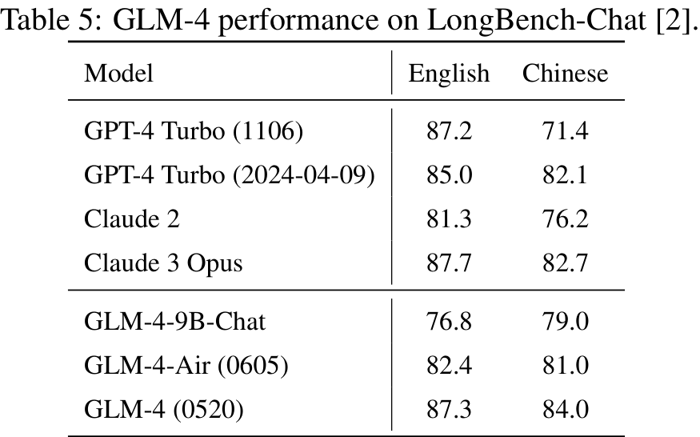

| Model                    | English | Chinese |
|--------------------------|---------|---------|
| GPT-4 Turbo (1106)       | 87.2    | 71.4    |
| GPT-4 Turbo (2024-04-09) | 85.0    | 82.1    |
| Claude 2                 | 81.3    | 76.2    |
| Claude 3 Opus            | 87.7    | 82.7    |
| GLM-4-9B-Chat            | 76.8    | 79.0    |
| GLM-4-Air (0605)         | 82.4    | 81.0    |
| GLM-4 (0520)             | 87.3    | 84.0    |

## Performance on NaturalCodeBench (NCB) [56]

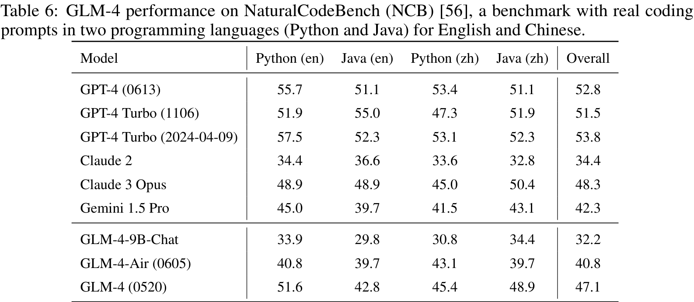

| Model                    | Python (en) | Java (en) | Python (zh) | Java (zh) | Overall |
|--------------------------|-------------|-----------|-------------|-----------|---------|
| GPT-4 (0613)             | 55.7        | 51.1      | 53.4        | 51.1      | 52.8    |
| GPT-4 Turbo (1106)       | 51.9        | 55.0      | 47.3        | 51.9      | 51.5    |
| GPT-4 Turbo (2024-04-09) | 57.5        | 52.3      | 53.1        | 52.3      | 53.8    |
| Claude 2                 | 34.4        | 36.6      | 33.6        | 32.8      | 34.4    |
| Claude 3 Opus            | 48.9        | 48.9      | 45.0        | 50.4      | 48.3    |
| Gemini 1.5 Pro           | 45.0        | 39.7      | 41.5        | 43.1      | 42.3    |
| GLM-4-9B-Chat            | 33.9        | 29.8      | 30.8        | 34.4      | 32.2    |
| GLM-4-Air (0605)         | 40.8        | 39.7      | 43.1        | 39.7      | 40.8    |
| GLM-4 (0520)             | 51.6        | 42.8      | 45.4        | 48.9      | 47.1    |

## Performance on the Berkeley Function Call Leaderboard

| Model                    | AST Summary | Exec Summary | Relevance | Overall |
|--------------------------|-------------|--------------|-----------|---------|
| Llama-3-8B-Instruct      | 59.25       | 70.01        | 45.83     | 58.88   |
| GPT-4 Turbo (2024-04-09) | 82.14       | 78.61        | 88.75     | 81.24   |
| GPT-4o (2024-05-13)      | 85.23       | 80.37        | 81.25     | 82.94   |
| ChatGLM3-6B              | 62.18       | 69.78        | 5.42      | 57.88   |
| GLM-4-9B-Chat            | 80.26       | 84.40        | 87.92     | 81.00   |
| GLM-4-Air (0605)         | 84.34       | 85.93        | 68.33     | 80.94   |
| GLM-4 (0520)             | 82.59       | 87.78        | 84.17     | 81.76   |

## Evaluation of Agent Abilities

It is widely observed that LLMs are capable to serve as intelligent agents in versatile environments and
contexts [29; 52], known as LLMs-as-Agents [23]. As a result, we evaluate GLM-4 together with other comparison LLMs on
AgentBench [23], a comprehensive agentic benchmark for text-based LLMs across an array of practical environments,
including code-based, game-based, and web-based contexts. Specifically, we evaluate on 7 out of 8 AgentBench
environments except for Digital Card Game, which takes much longer time to interact with. Overall scores are calculated
using the original per-dataset weights provided in AgentBench [23].

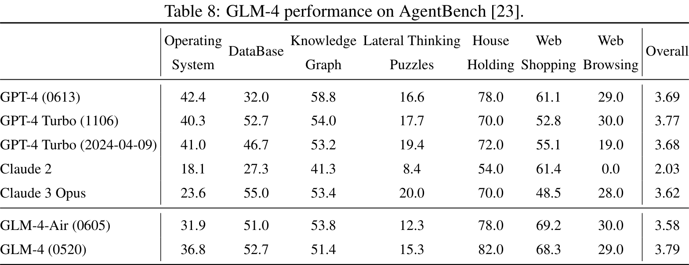

The results are presented in Table 8. As it shows, GLM-4 models present quite impressive performance on agent tasks,
with the GLM-4-Air's comparable and GLM-4's outperforming scores to GPT-4 Turbo and Claude 3 Opus. In terms of specific
environments, we find GLM-4 series performing especially well on Database, House-Holding, and Web Shopping tasks, while
still demonstrating a gap to GPT-4 series on Operating System, Knowledge Graph, and Lateral Thinking Puzzles. The gap
indicates that there is still some room for GLM-4 to improve its performance on code-related agentic tasks and highly
interactive language tasks.

## Evaluation of All Tools

GLM-4 is further aligned to support intelligent agents and user self-configured GLMs functionalities
on https://chatglm.cn, and the resultant model is GLM-4 All Tools. As mentioned, GLM-4 All Tools can complete complex
tasks by autonomously understanding user intent, planing step-by-step instructions, and calling multiple tools,
including web browser, Python interpreter, and the text-to-image model (e.g., CogView3 [59]). Table 9 shows that GLM-4
All Tools (Web) can generate similar

## erformance of GLM-4 All Tools.

## 4 Safety and Risks

We are committed to ensuring that GLM-4 operates as a safe, responsible, and unbiased model. In addition to addressing
common ethical and fairness concerns, we carefully assess and mitigate potential harms that the model may pose to users
in real-world scenarios.

Table 10: GLM-4 performance on SafetyBench [57], compared to GPT-4 models and Claude 3 Opus.

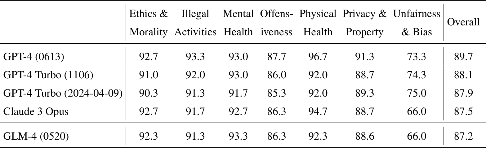

**Risk Mitigation.** We carefully clean data in the pre-training stage by removing text containing sensitive keywords
and web pages from a pre-defined blacklist. In the alignment phase, we evaluate each training sample for safety and
remove any that pose potential risks. Harmlessness is also an important criteria for preference alignment when comparing
multiple model outputs.

We have a red team that constantly challenges the model with tricky questions that tend to cause unsafe answers. We
collect all harmful question-answer pairs from GLM-4 and improve them with human annotations for further model
alignment.

**Safety Evaluation.** We evaluate the GLM-4 model on the SafetyBench [57] dataset, which assesses the capability of
each model from 7 dimensions: **Ethics and Morality** (unethical behaviors), **Illegal Activities** (basic knowledge of
law), **Mental Health** (adverse impacts on mental health), **Offensiveness** (offensive behaviors), **Physical Health
** (dangerous behaviors that can cause physical harms), **Privacy and Property** (privacy breach or property loss), *
*Unfairness and Bias**. We evaluate different models on the Chinese subset of SafetyBench, which is created by removing
highly sensitive questions that tend to be blocked, to mitigate interference from different API safety policies.

Table 10 shows the safety results of GLM-4 and SOTA models. On most dimensions GLM-4 (0520) shows competitive safety
performance, and overall it achieves comparable performance with Claude 3 Opus. GLM-4 slightly falls behind the GPT-4
family of models, especially on the Physical Health dimension, which demands robust common sense knowledge about the
physical world to avoid potential risks. More efforts have been put into this direction to develop a more capable and
safe GLM model.

## 5 Conclusion

In this report, we introduce the ChatGLM family of large language models from GLM-130B to GLM-4 (All Tools). Over the
past one and half years, we have made great progress in understanding various perspectives of large language models from
our first-hand experiences. With the development of each model generation, the team has learned and applied more
effective and more efficient strategies for both model pre-training and alignment. The recent ChatGLM models—GLM-4 (
0114, 0520), GLM-4-Air (0605), and GLM-4 All Tools—demonstrate significant advancements in understanding and executing
complex tasks by autonomously employing external tools and functions. These GLM-4 models have achieved performance on
par with, and in some cases superior to, state-of-the-art models such as GPT-4 Turbo, Claude 3 Opus, and Gemini 1.5 Pro,
particularly in handling tasks relevant to the Chinese language. In addition, we are committed to promoting
accessibility and safety of LLMs through open releasing our model weights and techniques developed throughout this
journey. Our open models, including language, code, and vision models, have attracted over 10 million downloads on
Hugging Face in the year 2023 alone. Currently, we are working on more capable models with everything we have learned to
date. In the future, we will continue democratizing cutting-edge LLM technologies through open sourcing, and push the
boundary of model capabilities towards the mission of teaching machines to think like humans.

## Acknowledgement

We would like to thank all the data annotators, infra operating staffs, collaborators, and partners as well as everyone
at Zhipu AI and Tsinghua University not explicitly mentioned in the report who have provided support, feedback, and
contributed to ChatGLM. We would also like to thank Yuxuan Zhang and Wei Jia from Zhipu AI as well as the teams at
Hugging Face, ModelScope, WiseModel, and others for their help on the open-sourcing efforts of the GLM family of models.

## References

[1] Y. Bai, X. Lv, J. Zhang, Y. He, J. Qi, L. Hou, J. Tang, Y. Dong, and J. Li. Longlian: A recipe for long context
alignment of large language models, 2024.

[2] Y. Bai, X. Lv, J. Zhang, H. Lyu, J. Tang, Z. Huang, Z. Du, X. Liu, A. Zeng, L. Hou, Y. Dong, J. Tang, and J. Li.
Longbench: A bilingual, multitask benchmark for long context understanding, 2024.

[3] T. B. Brown, B. Mann, N. Ryder, M. Subbiah, J. Kaplan, P. Dhariwal, A. Neelakantan, P. Shyam, G. Sastry, A. Askell,
S. Agarwal, A. Herbert-Voss, G. Krueger, T. Henighan, R. Child, A. Ramesh, D. M. Ziegler, J. Wu, C. Winter, C. Hesse, M.
Chen, E. Sigler, M. Litwin, S. Gray, B. Chess, J. Clark, C. Berner, S. McCandlish, A. Radford, I. Sutskever, and D.
Amodei. Language models are few-shot learners. In Proceedings of the 34th International Conference on Neural Information
Processing Systems, NIPS’20, Red Hook, NY, USA, 2020. Curran Associates Inc.

[4] M. Chen, J. Tworek, H. Jun, Q. Yuan, H. P. de Oliveira Pinto, J. Kaplan, H. Edwards, Y. Burda, N. Joseph, G.
Brockman, A. Ray, R. Puri, G. Krueger, M. Petrov, H. Khlaaf, G. Sastry, P. Mishkin, B. Chan, S. Gray, N. Ryder, M.
Pavlov, A. Power, L. Kaiser, M. Bavarian, C. Winter, T. Tillet, F. P. Such, D. Cummings, M. Plappert, F. Chantzis, E.
Barnes, A. Herbert-Voss, W. H. Guss, A. Nichol, A. Paino, N. Tezak, J. Tang, I. Babuschkin, S. Balaji, S. Jain, W.
Saunders, C. Hesse, A. N. Carr, J. Leike, J. Achiam, V. Misra, E. Morikawa, A. Radford, M. Knight, M. Brundage, M.
Murati, K. Mayer, P. Welinder, B. McGrew, D. Amodei, S. McCandlish, I. Sutskever, and W. Zaremba. Evaluating large
language models trained on code. CoRR, abs/2107.03374, 2021.

[5] S. Chen, S. Wong, L. Chen, and Y. Tian. Extending context window of large language models via positional
interpolation. arXiv preprint arXiv:2306.15559, 2023.

[6] A. Chowdhery, S. Narang, J. Devlin, M. Bosma, G. Mishra, A. Roberts, P. Barham, H. W. Chung, C. Sutton, S. Gehrmann,
et al. Palm: Scaling language modeling with pathways. arXiv preprint arXiv:2204.02311, 2022.

[7] K. Cobbe, V. Kosaraju, M. Bavarian, M. Chen, H. Jun, L. Kaiser, M. Plappert, J. Tworek, J. Hilton, R. Nakano, C.
Hesse, and J. Schulman. Training verifiers to solve math word problems. CoRR, abs/2110.14168, 2021.

1. T. Dao, D. Fu, S. Ermon, A. Rudra, and C. Ré. Flashattention: Fast and memory-efficient exact attention with
   i/o-awareness. *Advances in Neural Information Processing Systems*, 35:16344–16359, 2022.

2. X. Deng, Y. Gu, B. Zheng, S. Chen, S. Stevens, B. Wang, H. Sun, and Y. Su. Mind2web: Towards a generalist agent for
   the web. *arXiv preprint arXiv:2306.06070*, 2023.

3. M. Ding, Z. Yang, W. Hong, W. Zheng, C. Zhou, D. Yin, J. Lin, X. Zou, Z. Shao, H. Yang, and J. Tang. Cogview:
   Mastering text-to-image generation via transformers, 2021.

4. Z. Du, Y. Qian, X. Liu, M. Ding, J. Qiu, Z. Yang, and J. Tang. Glm: General language model pretraining with
   autoregressive blank infilling. In *Proceedings of the 60th Annual Meeting of the Association for Computational
   Linguistics (Volume 1: Long Papers)*, pages 320–335, 2022.

5. Z. Du, A. Zeng, Y. Dong, and J. Tang. Understanding emergent abilities of language models from the loss perspective,
    2024.

6. T. GLM. Chatglm-6b: An open bilingual dialogue language model. <https://github.com/ THUDM/ChatGLM-6B>, 2023.

7. D. Hendrycks, C. Burns, S. Basart, A. Zou, M. Mazeika, D. Song, and J. Steinhardt. Measuring massive multitask
   language understanding. In *International Conference on Learning Representations*, 2021.

8. D. Hendrycks and K. Gimpel. Gaussian error linear units (gelus). *arXiv preprint arXiv:1606.08415*, 2016.

9. W. Hong, W. Wang, Q. Lv, J. Xu, W. Yu, J. Ji, Y. Wang, Z. Wang, Y. Zhang, J. Li, B. Xu, Y. Dong, M. Ding, and J.
   Tang. Cogagent: A visual language model for gui agents, 2023.

10. Z. Hou, Y. Niu, Z. Du, X. Zhang, X. Liu, A. Zeng, Q. Zheng, M. Huang, H. Wang, J. Tang, and Y. Dong. Chatglm-rlhf:
    Practices of aligning large language models with human feedback, 2024.

11. Y. Li, S. Bubeck, R. Eldan, A. D. Giorno, S. Gunasekar, and Y. T. Lee. Textbooks are all you need ii: phi-1.5
    technical report, 2023.

12. P. Liang, R. Bommasani, T. Lee, D. Tsipras, D. Soylu, M. Yasunaga, Y. Zhang, D. Narayanan, Y. Wu, A. Kumar, B.
    Newman, B. Yuan, B. Yan, C. Zhang, C. Cosgrove, C. D. Manning, C. Ré, D. Acosta-Navas, D. A. Hudson, E. Zelikman, E.
    Durmus, F. Ladhak, F. Rong, H. Ren, H. Ho, J. Wang, K. Santhanam, L. Orr, L. Zheng, M. Yukkesekongul, M. Surgen, N.
    Kim, N. Guh, N. Chatterji, O. Khattab, P. Henderson, Q. Huang, R. Chi, S. M. Xie, S. Santurkar, S. Ganguli, T.
    Hashimoto, T. Icard, T. Zhang, V. Chaudhary, W. Wang, X. Li, Y. Mai, Y. Zhang, and Y. Koreeda. Holistic evaluation
    of language models, 2023.

13. M. Liu, A. Zeng, B. Wang, P. Zhang, J. Tang, and Y. Dong. Apar: Llms can do auto-parallel auto-regressive decoding.
    *arXiv, abs/2401.07661*, 2024.

14. X. Liu, X. Lei, S. Wang, Y. Huang, Z. Feng, B. Wen, J. Cheng, P. Ke, Y. Xu, W. L. Tam, X. Zhang, L. Sun, H. Wang, J.
    Zhang, M. Huang, Y. Dong, and J. Tang. Alignbench: Benchmarking chinese alignment of large language models, 2023.

15. X. Liu, X. Song, Y. Dong, and J. Tang. Extensive self-contrast enables feedback-free language model alignment, 2024.

16. X. Liu, H. W. Zhang, Y. Xu, X. Lei, H. Lai, Y. Gu, H. Ding, K. Men, K. Yang, S. Zhang, X. Deng, A. Zeng, Z. Du, C.
    Zhang, S. Shen, T. Zhang, Y. Su, H. Sun, M. Huang, Y. Dong, and J. Tang. Cogentbench: Evaluating llms as agents,
    2023.

17. Meta. Introducing meta llama 3: The most capable openly available llm to
    date. <https://ai.meta.com/blog/meta-llama-3/>, 2024.

18. OpenAI. Introducing chatgpt. <https://openai.com/blog/chatgpt>, 2022.

19. OpenAI. tiktoken. <https://github.com/openai/tiktoken>, 2023.

[27] R. OpenAI. Gpt-4 technical report. arXiv, pages 2303–08774, 2023.

[28] L. Ouyang, J. Wu, X. Jiang, D. Almeida, C. Wainwright, P. Mishkin, C. Zhang, S. Agarwal, K. Slama, A. Ray, et al.
Training language models to follow instructions with human feedback. Advances in Neural Information Processing Systems,
35:27730–27744, 2022.

[29] J. S. Park, J. O’Brien, C. J. Cai, M. R. Morris, P. Liang, and M. S. Bernstein. Generative agents: Interactive
simulacra of human behavior. In Proceedings of the 36th Annual ACM Symposium on User Interface Software and Technology,
pages 1–22, 2023.

[30] O. Press, N. Smith, and M. Lewis. Train short, test long: Attention with linear biases enables input length
extrapolation. In International Conference on Learning Representations, 2022.

[31] D. Rein, B. L. Hou, A. C. Stickland, J. Petty, R. Y. Pang, J. Dirani, J. Michael, and S. R. Bowman. GPQA: A
graduate-level google-proof q&a benchmark. CoRR, abs/2311.12022, 2023.

[32] T. L. Scao, A. Fan, C. Akiki, E. Pavlick, S. Ilić, D. Hesslow, R. Castagné, A. S. Luccioni, F. Yvon, M. Gallé, et
al. Bloom: A 176b-parameter open-access multilingual language model. arXiv preprint arXiv:2211.05100, 2022.

[33] R. Sennrich, B. Haddow, and A. Birch. Neural machine translation of rare words with subword units. In Proceedings
of the 54th Annual Meeting of the Association for Computational Linguistics (Volume 1: Long Papers), pages 1715–1725,
Berlin, Germany, 2016. Association for Computational Linguistics.

[34] N. Shazeer. Fast transformer decoding: One write-head is all you need. arXiv preprint arXiv:1911.02150, 2019.

[35] N. Shazeer. Glu variants improve transformer. 2020.

[36] M. Shridhar, X. Yuan, M.-A. Cote, Y. Bisk, A. Trischler, and M. Hausknecht. Alfworld: Aligning text and embodied
environments for interactive learning. In International Conference on Learning Representations, 2020.

[37] A. Srivastava, A. Rastogi, A. Rao, A. A. M. Shoeb, A. Abdi, A. Fisch, A. R. Brown, A. Santoro, A. Gupta, A.
Garriga-Alonso, A. Kluska, A. Lewkowycz, A. Agarwal, A. Power, A. Ray, A. Warstadt, A. W. Kouwekerk, A. Safaya, A.
Tazarv, A. Xiang, A. Parrish, A. Nie, A. Hussain, A. Askell, A. Dsouza, A. Rahane, A. S. Iyer, A. Andreasen, A.
Santilli, A. Schuhmuller, A. M. Dai, A. La, A. K. Lampinen, A. Zou, A. Liang, A. Chen, A. Vong, A. Gupta, A. Gotfryd, A.
Norelli, A. Venkatesh, A. Gholami, A. Tavakkol, A. Tabassum, A. Menes, A. Kuribayashi, A. Mullokandov, A. Sabahnavard,
A. Herckis, A. Efrat, A. Erdem, A. Karakas, and et al. Beyond the imitation game: Quantifying and extrapolating the
capabilities of language models. CoRR, abs/2206.04615, 2022.

[38] J. Su, Y. Lu, S. Pan, A. Murtadha, B. Wen, and Y. Liu. Roformer: Enhanced transformer with rotary position
embedding. arXiv preprint arXiv:2104.09864, 2021.

[39] M. Suzgun, N. Scales, N. Schärli, S. Gehrmann, Y. Tay, H. W. Chung, A. Chowdhery, Q. V. Le, E. H. Chi, D. Zhou, and
J. Wei. Challenging big-bench tasks and whether chain-of-thought can solve them. In A. Rogers, J. L. Boyd-Graber, and N.
Okazaki, editors, Findings of the Association for Computational Linguistics: ACL 2023, Toronto, Canada, July 9-14, 2023,
pages 1303–1351. Association for Computational Linguistics, 2023.

[40] G. Team, R. Anil, S. Borgeaud, Y. Wu, J.-B. Alayrac, J. Yu, R. Soricut, J. Schalkwyk, A. M. Dai, A. Habib, K.
Milligan, D. Silver, S. Petrov, M. Johnson, I. Antonoglou, J. Schritweiser, A. Glaese, J. Chen, E. Pliter, T. Lillicrap,
A. Lazaridou, O. Firat, J. Molloy, M. Isard, R. P. Barham, T. Langlois, B. Lee, F. Vicol, M. Reynolds, Y. Xu, R.
Doherty, E. Collins, C. Meyer, E. Rutherford, E. Moreira, K. Ayoub, M. Goel, G. Tucker, E. Piqueras, M. Krikun, I. Barr,
N. Savinov, I. Danihelka, B. Roelofs, A. White, A. Andreassen, T. von Glehn, L. Yagati, M. Kazemi, L. Gonzalez, M.
Kahlman, J. Sygnowski, A. Frechette, C. Smith, L. Culp, P. Loreev, Y. Luan, X. Chen, J. Lottes, N. Schucher, F. Lebron,
A. Rrustemi, N. Chay, P. Crone, T. Kocisky, J. Zhao, B. Perz, D. Yu, H. Howard, A. Bloniziar, J. W. Rae, H. Lu, L.
Sifre,

M. Maggioni, F. Alcober, D. Garnette, M. Barnes, S. Thakoor, J. Austin, G. Barth-Maron, W. Wong, J. Foshi, R. Chaabouni,
D. Fathma, A. Ahuja, R. Liu, Y. Li, S. Cogan, J. Chen, C. Jia, E. Guo, Q. Zhang, J. Grimstead, A. J. Hartman, M.
Chadwick, G. S. Tomar, X. Garcia, E. Senter, E. Taropa, T. S. Pillai, J. Devlin, M. Laskin, D. de Las Casas, D. Valter,
C. Tao, L. Blanco, A. P. Badia, D. Rettler, M. Chen, J. Brennan, C. Rivera, S. Brin, S. Iqbal, G. Surita, J. Labonarski,
A. Rao, S. Winkler, E. Parisiot, Y. Gu, K. Olszewski, Y. Zhang, R. Addanki, A. Miech, A. Louis, L. E. Hasey, D.
Beylasihin, G. Brown, E. C. Catt, N. Atlaluri, J. Balaguer, J. Xiang, P. Wang, Z. Ashwood, A. Briukhova, A. Webson, S.
Ganapathy, S. Sanghavi, A. Kamann, M.-W. Chang, A. Stingeron, J. Djologny, S. Yuh, A. Bapna, M. Aitchison, P. Pejman, H.
Michaelvski, T. Yu, C. Wang, J. Love, J. Ahn, D. Blokovich, K. Han, P. Humphreys, T. Sellam, J. Bradbury, V. Godbole, S.
Samanoohei, B. Damoc, A. Kaskasoli, S. M. R. Arnold, V. Vasudevan, S. Agarwal, J. Riesa, D. Lepikhkin, R. Tanburn, S.
Srinivasan, H. Lim, S. Hodkinson, P. Shyam, J. Ferret, S. Hand, A. Garg, T. L. Paine, J. Li, Y. Li, M. Giang, A. Neitz,
A. Abbas, S. York, M. Reid, E. Cole, A. Chowdhery, D. Das, D. Roziqoska, V. Nikolayev, P. Sprechmann, K. Zado, L. Zilka,
F. Prost, H. He, M. Monteiro, G. Mishra, C. Welty, J. Newlan, D. Jia, M. Allamans, C. H. Liu, R. de Liedekerke, J.
Gilmer, C. Saroufim, S. Rijhwani, S. Hou, D. Shrivastava, A. Badeddupi, A. Goldin, A. Ozturel, A. Cassirer, Y. Xu, D.
Sohn, D. Sachan, R. K. Piyush, C. Swan- son, D. Petrova, S. Narayan, A. Guez, S. Brahma, J. Lamond, M. Patel, R. Zhao,
K. Villela, L. Wang, J. Ma, M. Sabini, M. Giménez, L. Yeung, H. Lin, J. Keeling, P. Georgakis, A. Cohen, B. Wu, S.
Haykal, R. Saputro, K. Vodrahalli, J. Qin, Z. Cankara, A. Sharma, N. Fernando, W. Hawkins, B. Neyshabur, S. Kim, A.
Hutter, P. Agarwal, A. Castro-Ros, G. van den Broek, T. Wang, F. Yang, S. yin Chang, P. Komarek, R. McIlroy, M. Lučić,
G. Zhang, W. Rahman, M. Sharman, P. Natsev, P. Michel, Y. Cheng, Y. Bansal, S. Qiao, K. Cao, S. Shakeri, C. Butterfield,
J. Chung, P. K. Rishikesh, S. Agrawal, A. Mensch, K. Soparkar, K. Lenc, T. Chung, A. Pope, L. Maggiore, J. Kay, P.
Jhakra, S. Wang, J. Maynez, M. Phuong, T. Tobin, A. Tacchetti, M. Tecar, B. Korvet, J. Kataria, S. Riedel, P. Bailey, X.
Xiao, N. Goyal, T. Kocisky, A. Shlone, N. Houlsby, X. Xiong, Z. Yang, E. Gribovskaya, J. Adler, M. Wirth, L. Le, M. L.
Posa, J. A. Rodriguez, S. Bridges, A. Roberts, S. G. Shewmaker, Z. Ulmer, T. Liu, R. Pow- ell, S. G. Colmenarejo, J.
Bradbury, A. J. B. Chan, J. Lemoine, A. V. Panov, J. M. R. Tapia, S. Xi, J. Greer, G. Su, M. Polacek, R. L. Kaufman, S.
Tokumine, H. Du, E. Buchatskaya, Y. Miao, M. Elhawary, A. Siddhnath, N. Tomashev, J. Xing, C. Greer, H. Hill, B.
Matsuda, A. Roy, Z. Zhang, A. Ma, A. Filos, M. Besta, B. Blevins, T. Klimenko, C.-K. Yeh, S. Chanping, J. Mu, O. Chang,
M. Pajarskas, C. Muir, V. Cohen, C. L. Lan, K. Haridasan, A. Chumanev, A. Shansen, S. Douglas, R. Samuel, M. Wang, S.
Avraham, C. Lan, J. Jiang, J. Chu, J. A. Lorenzo, L. Lo- Spinosi, S. Sequeira, Z. Gliecher, T. Aravamuthan, A. Boral, H.
Srinivasan, Y. Selo, L. Nax, A. Zlo- pos, L. Hussell, E. Zeng, M. Bevil, M. B. Chang, A. Recasens, S. Belkin, A. Pitzer,
F. Pavetic, F. Pardo, A. Gergely, J. Frye, V. Ramasesh, D. Horgan, K. Badola, N. Kassem, S. Roy, D. Eyer, A. Quamolos,
A. Tang, D. E. Badawey, E. Whites, B. Doumas, A. B. Bhatt, J. Alindja, S. Vikram, Z. Gong, S. Scaelles, R. Hemsley, G.
Thornton, F. Feng, W. Stokowiec, C. Zheng, P. Thacker, Çaglar Ünlü, Z. Zhang, M. Saleh, J. Svensson, M. Bilesichi, P.
Tail, A. Anand, R. Ring, K. Tsihlas, A. Vezner, M. Selvi, T. Shelame, M. Rodriguez, T. Kwiatkowski, S. Daruki, K. Kong,
A. Dafoe, N. Fitzgerald, K. Gu-Lemberg, M. Khan, Z. A. Hendricks, M. Pellat, V. Feinberg, J. Cobon-Kerr, T. Saint, M.
Rauh, S. H. Hashemi, R. Keys, H. Hasson, Y. Li, E. Noland, Y. Cao, N. Byrd, L. Hou, Q. Wang, T. Sottiaux, M. Paganini,
J.-B. Lespiau, A. Moufarek, S. Hassan, K. Shivakumar, J. van Amersfoort, A. Mandhane, P. Joshi, A. Goyal, M. Tung, A.
Brock, H. Sheahan, V. Misra, C. Li, N. Rakićević, M. Dehghani, F. Liu, S. Mittal, O. Jho, S. Noury, E. Sezener, H.
Fourt, M. Lamm, N. D. Cao, C. Chen, G. Elsayed, E. Chi, M. Mahdavi, H. Tenney, N. Hua, I. Petrychenko, P. Kane, D.
Scanduiano, R. Jain, J. Uselato, R. Datla, A. Sadovsky, O. Bunyan, D. Rabicj, S. Wu, J. Zhang, G. Vasudevan, L. Everett,
M. Al- nahwiati, I. Georgescu, N. Wei, Z. Zheng, B. Chan, P. G. Rabinovitch, P. Zaytsev, Y. Zhang, D. Steiner, S.
Naskar, M. Azzam, M. Johnson, A. Paszke, C.-C. Chiu, J. S. Elias, A. Mohlab, J. H. Muhammad, J. Miao, A. Lee, N.
Veillard, S. Potluri, J. Park, E. Dovadi, J. Zhang, J. Stanway, D. Garmon, A. Karmarkar, Z. Dong, J. Lee, A. Kumar, L.
Zhao, J. Evens, W. Isaac, J. Chen, J. Hsiao, A. Levskaya, Z. Zhu, C. Gorjewski, P. Grabowski, Y. Mao, A. Magnik, K. Yao,
J. Snader, P. Casagrande, P. Spuantahn, E. Palmer, M. Irvine, E. Loper, M. Verma, J. Arkatar, D. Nen, T. Shahrad, M.
Fink, A. Castalino, I. Giannoumis, W. Kim, M. Rybiński, A. Sreveska, J. Prendki, D. Soergel, A. Goedecker, V. Grieve, M.
Jafari, M. Gaba, J. Iwessen, D. Or- Wright, Y. Wei, H. Vashisth, Y. Kulizhskaya, J. Hoover, M. Le, L. Li, C. Iwuanyanwu,
L. Liu, K. Ramirez, A. Khorlin, A. Cui, T. LIN, M. Georgeiv, M. Wu, R. Aguilar, K. Pallo, A. Chakladar,

A. Repina, X. Wu, T. van der Weide, P. Ponnappalli, C. Kaplan, J. Simsa, S. Li, O. Dousse, F. Yang, J. Piper, N. Te, M.
Lui, R. Pasumarthi, N. Lintz, A. Vijayakumar, L. N. Thiet, D. Andor, P. Valenzuela, C. Nardumaru, D. Peng, K. Lee, S.
Zhang, S. Greene, D. D. Nguyen, P. Kurylowicz, E. Valley, S. Krause, C. Hardin, D. Lioux, L. Janzer, K. Choo, Z. Feng,
B. Zhang, A. Singhal, T. Latkar, N. Zhang, Q. Lee, E. A. Abel, D. Du, D. McKinnon, N. Antroypov, T. Bolukbasi, O.
Keller, D. Reid, D. Finkelshtein, M. A. Raad, R. Crocker, J. Hawkins, R. Padashi, C. Gaffney, S. Leila, T. Franko, E.
Filonov, A. Bulanova, R. Leblond, Y. Yadav, S. Chung, H. Askham, L. C. Cobo, K. Xu, F. Fischer, J. Xu, C. Sorokin, C.
Albrecht, C.-L. Cin, C. Evans, Z. Zhou, A. Dimitriev, H. Forbes, D. Banarse, Z. Tung, J. Liu, M. Omernick, C. Bishop, C.
Kumar, R. Stenner, K. Foley, R. Jain, S. Mishra, J. Xia, T. Bos, G. Cierdon, E. Admina, F. Piccinno, X. Wang, P. Banzal,
P. Gurita, H. Noga, P. Shah, D. J. Mankowitz, A. Polozov, N. Kushman, V. Krakovna, S. Brown, M. Bateni, D. Duan, V.
Firoiu, M. Thtokatuyi, T. Natan, A. Mohanarey, M. Geist, S. Mudgal, S. Girgin, H. Li, J. Ye, O. Roval, R. Tojo, K. Wong,
J. Lee-Thorp, K. Yew, Q. Yuan, S. Bagri, D. Sinopalnikov, S. Ramos, J. Morell, A. Sharma, A. Severn, J. Lai, K. Wu,
H.-T. Cheng, D. Miller, N. Sonnerat, D. Vnukvo, R. Greig, J. Battelino, E. Caveness, B. Bai, J. Eisenschlos, A.
Korenchyn, T. Tsai, M. Isaveiev, W. Kong, P. Dao, Z. Zheng, F. Liu, F. Yang, R. Zhu, M. Geller, T. He, T. Janmja, E.
Giakoumidis, N. Tridin, A. Sozanisch, D. Toyama, E. Rosen, A. Tavakkol, L. Xue, C. Elkind, O. Woodman, J. Carpenter, A.
Zolna, C. Huang, P. Ksen, P. Kafe, T. Grunina, Z. Sinha, A. Talbert, A. Goyal, D. Wu, D. Owusu-Afriyie, C. Du, C.
Thornton, J. Pont-Tuset, P. Narayana, J. Li, S. Fatehi, J. Wieting, O. Ajmeri, S. Uria, T. Thuy, K. Ko, L. Knight, A.
Hélou, N. Niu, S. Gu, P. Cao, J. Tran, K. Li, N. Devine, A. Stolovich, N. Kalb, R. Santamaria-Fernandez, S. Goenka, W.
Yustalim, R. Strudel, A. Elqursh, B. Lakshminarayanan, C. Deck, S. Upadhyay, H. Lee, M. Dusenberry, Z. Li, X. Wang, K.
Levin, R. Hoffmann, D. Holtmann-Rice, O. Bachmen, S. W. S. Arora, E. Mailmi, D. Mirylenka, Q. Tan, C. Koh, S. H.
Yeganeh, S. Poder, Z. Zheng, P. Fongtoni, M. Tariq, Y. Sun, L. Lonita, M. Stoian, E. Spindel, T. Patti, R. Kotikalapudi,
Z. Li, A. Gatti, J. Liu, X. Ye, B. Chrzascz, L. Wang, N. Sethi, J. T. Bi, R. Brown, S. Singh, W. Fan, A. Parisi, J.
Stanton, C. Xuang, Y. Wang, W. Che, A. Nouguettchoo, D. Ly, T. L. Lu, J. Fei, Y. Wang, H. P. Sun, L. Zhang, M. L. Jones,
M. J. Zhang, Y. Zhang, C. Zhang, S. Dasgupta, D. Bugdayci, D. S. Bapst, D. Jones, P. T. Scibona, R. Bobenek, B. Mittal,
B. Albrecht, M. Shenoy, F. Moiseev, H. Jacobson, A. Ghaffarkhah, M. Riviere, A. Walton, C. Crepy, A. Parrish, Y. Liu, Z.
Zhou, C. Farabet, C. Rabadagu, P. Srinivasan, C. vander Salm, A. Fidjeland, S. Scellato, L. Latero-Chimoto, H.
Klimack-Puciinska, D. Bridson, D. de Cesare, T. Hudson, P. Mendelohicke, L. Walker, A. Morris, I. Penchev, M. Marquez,
A. Gusevnov, A. Reid, S. Odom, L. Loker, V. Cortuta, M. Venguia, D. Grewe, A. Petrushkina, T. Duerig, A. Sanchez, S.
Yadlovsky, A. Shen, A. Globerson, A. Kurzrok, L. Webb, S. Dua, D. Li, P. Laloth, S. Bhupatiraju, D. Hurt, H. Qureshi, A.
Agarwal, T. Shani, M. Eyal, A. Khare, S. R. Belle, L. Wang, C. Tekur, M. S. Kale, J. Wei, R. Sang, B. Saeta, T. Licci,
Y. Sun, Y. Zhao, S. Lee, P. Nayak, D. Fritz, M. R. Yuyuru, J. Judaslas, N. Vyas, M. Wieck, X. Ma, T. Bilal, E. Eltyshev,
D. Balle, N. Martin, H. Cate, J. Manyika, K. Amiri, Y. Kim, X. Xiong, K. Kang, F. Lisière, N. Tripuraneni, D. Madras, M.
Gold, A. Wong, A. Wang, J. Ainslie, J. Blaifberg, H. Zhang, G. Pruthi, J. Bauer, F. Yang, R. Mansour, J. Gelman, Y. Xu,
G. Polovets, J. Liu, H. Cai, W. Chen, X. Sheng, E. Xue, S. Ozair, A. Yu, C. Amgenmuller, X. Li, W. Wang, J. Weisenger,
E. Koukoumidis, Y. Tian, A. Iyer, M. Gurumurthy, M. Goldenson, P. Shah, M. Blake, H. Yu, A. Urbanowicz, J. Palomaki, C.
Fernando, K. Brooks, K. Durden, H. Mehta, N. Momchev, E. Rahimtoroghi, M. Georgaki, A. Raul, S. Ruder, M. Redshaw, J.
Lee, K. Jalan, D. Li, G. Perng, B. Hechtman, P. Schuh, M. Nasr, M. Chen, K. Milan, M. Mikulik, T. Strohman, J. Franco,
T. Green, D. Hassabis, K. Kavukcuoglu, J. Dean, and O. Vinyals. Gemini: A family of highly capable multimodal models,2023.

[41] H. Touvron, T. Lavril, G. Izacard, X. Martinet, M.-A. Lachaux, T. Lacroix, B. Rozière, N. Goyal, E. Hambro, F.
Azhar, A. Rodriguez, J. Joulin, L. Grave, and G. Lample. Llama: Open and efficient foundation language models, 2023.

[42] H. Touvron, L. Martin, K. Stone, P. Albert, A. Almahairi, Y. Babaei, N. Bashlykov, S. Batra, P. Bhargava, S.
Bhaskar, D. Bikel, L. Blecher, C. E. Ferrer, M. Chen, G. Cucurull, D. Elbou, J. Fernandes, J. Fu, W. Fu, B. Fuller, C.
Gao, V. Goswami, N. Goyal, A. Hartshorn, S. Hosseini, R. Hou, H. Inan, M. Kardas, V. Kerkez, M. Khabsa, I. Klowmann, A.
Koren, P. S. Koura, M.-A. Lachaux, T. Lavril, J. Lee, D. Liskovich, Y. Lu, Y. Mao, X. Martinet, T. Mihaylov, P. Mishra,
I. Molybo, Y. N. Neale, A. Poulton, J. Reizenstein, R. Rungta, K. Saladi, A. Schick, T. Schmid, R. Smith, R.
Subramanian, X. E. Tan, B. Tang, R. Taylor, A. Williams, J. X. Kuan, P. Xu, Z. Yan.

1. I. Zarov, Y. Zhang, A. Fan, M. Kambadur, S. Narang, A. Rodriguez, R. Stojnic, S. Edunov, and T. Scialom. Llama 2:
   Open foundation and fine-tuned chat models, 2023.

2. A. Vaswani, N. Shazeer, N. Parmar, J. Uszkoreit, L. Jones, A. N. Gomez, L. Kaiser, and I. Polosukhin. Attention is
   all you need, 2023.

3. H. Wang, S. Ma, L. Dong, S. Huang, D. Zhang, and F. Wei. Deepnet: Scaling transformers to 1,000 layers, 2022.

4. W. Wang, Q. Lv, W. Yu, W. Hong, J. Qi, Y. Wang, J. Ji, Z. Yang, L. Zhao, X. Song, J. Xu, B. Xu, J. Li, Y. Dong, M.
   Ding, and J. Tang. Coglm: Visual expert for pretrained language models, 2023.

5. J. Wei, X. Wang, D. Schuurmans, M. Bosma, B. Ichter, F. Xia, E. H. Chi, Q. V. Le, and D. Zhou. Chain-of-thought
   prompting elicits reasoning in large language models. In S. Koyejo, S. Mohamed, A. Agarwal, D. Belgrave, K. Cho, and
   A. Oh, editors, Advances in Neural Information Processing Systems 35: Annual Conference on Neural Information
   Processing Systems 2022, NeurIPS 2022, New Orleans, LA, USA, November 28 - December 9, 2022, 2022.

6. W. Xiong, J. Liu, I. Molloyog, H. Zhang, P. Bhargava, R. Hou, L. Martin, R. Rungta, K. A. Sankararaman, B. Oguz, et
   al. Effective long-context scaling of foundation models. arXiv preprint arXiv:2309.16039, 2023.

7. X. Xu, X. Liu, X. Liu, Z. Hou, Y. Li, X. Zhang, Z. Wang, A. Zeng, Z. Du, W. Zhao, J. Tang, and Y. Dong. Chatglm-math:
   Improving math problem-solving in large language models with a self-critique pipeline, 2024.

8. F. Yan, H. Mao, C. C.-J. Ji, T. Zhang, S. G. Patil, I. Stoica, and J. E. Gonzalez. Berkeley function calling
   leaderboard. 2024.

9. S. Wang, W.-L. Chiang, L. Zheng, J. E. Gonzalez, and I. Stoica. Rethinking benchmark and contamination for language
   models with rephrased samples. arXiv preprint arXiv:2311.04850, 2023.

10. S. Yao, H. Chen, J. Yang, and K. Narasimhan. Webshop: Towards scalable real-world web interaction with grounded
    language agents. Advances in Neural Information Processing Systems 35:20744–20757, 2022.

11. S. Yao, J. Zhao, D. Yu, N. Du, I. Shafran, K. Narasimhan, and Y. Cao. React: Synergizing reasoning and acting in
    language models. arXiv preprint arXiv:2210.03629, 2022.

12. J. Zeng, M. Liu, R. Lu, B. Wang, X. Liu, Y. Dong, and J. Tang. Agenttuning: Enabling generalized agent abilities for
    llms, 2023.

13. J. Zeng, X. Liu, Z. Du, Z. Wang, H. Lai, M. Ding, Z. Yang, Y. Xu, W. Zheng, X. Xia, et al. Glm-130b: An open
    bilingual pre-trained model. arXiv preprint arXiv:2210.02414, 2022.

14. S. Zhang, S. Roller, N. Goyal, M. Artetxe, M. Chen, S. Chen, C. Dewan, M. Diab, X. Li, X. V. Lin, et al. Opt: Open
    pre-trained transformer language models. arXiv preprint arXiv:2205.01068, 2022.

15. S. Zhang, H. Zhao, X. Liu, Q. Zheng, Z. Qi, X. Gu, X. Zhang, Y. Dong, and J. Tang. Naturalcodebench: Examining
    coding performance mismatch on humaneval and natural user prompts. arXiv preprint arXiv:2405.04520, 2024.

16. Z. Zhang, L. Lei, L. Wu, R. Sun, Y. Huang, C. Long, X. Liu, X. Lei, J. Tang, and M. Huang. Safetybench: Evaluating
    the safety of large language models with multiple choice questions. arXiv preprint arXiv:2309.07045, 2023.

17. Q. Zheng, X. Xia, X. Zou, Y. Dong, S. Wang, Y. Xue, Z. Wang, L. Shen, A. Wang, Y. Li, T. Su, Z. Yang, and J. Tang.
    Codegeex: A pre-trained model for code generation with multilingual evaluations on humaneval-x, 2023.

18. W. Zheng, J. Teng, Z. Yang, W. Wang, J. Chen, X. Gu, Y. Dong, M. Ding, and J. Tang. Cogview3: Finer and faster
    text-to-image generation via relay diffusion, 2024.

[60] C. Zhou, P. Liu, P. Xu, S. Iyer, J. Sun, Y. Mao, X. Ma, A. Efrat, P. Yu, L. Yu, S. Zhang, G. Ghosh, M. Lewis, L.
Zettlemoyer, and O. Levy. Lima: Less is more for alignment, 2023.

[61] J. Zhou, T. Lu, S. Mishra, S. Brahma, S. Basu, Y. Luan, D. Zhou, and L. Hou. Instruction-following evaluation for
large language models. *arXiv preprint arXiv:2311.07911*, 2023.